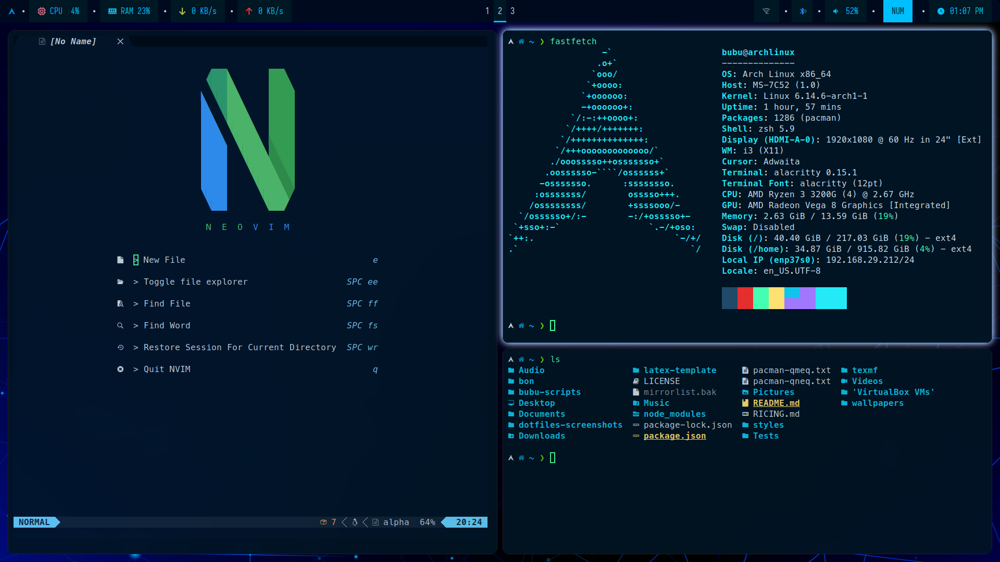

# ARCH i3 Dotfiles

This repository contains my ARCH i3 dotfiles. It also contains:

- Instructions for setting up these dotfiles on a freshly
  installed system
- My custom LaTeX template, which I use and sometimes share

Thanks a lot to @rosemarys_baby for helping me out whenever
I was clueless during my first Arch installation.

After being almost a complete year into using Arch as my
primary OS, I get why the veterans are so fixated on making
the newbies read the
[Arch Wiki installation guide][archinstallguide].
Read the Wiki people. :joy:

A few resources for installing Arch Linux:

- [Arch Wiki installation guide][archinstallguide]
- [Arch installation guide by Mental Outlaw][mentaloutarchinstall]
- [Setting up Graphical Environments and
  Users by Luke Smith][archlinuxlukesmith]

## Ricing a fresh system with my Dotfiles

- Follow [this][ricing] guided manual for ricing the setup.

Here is the screenshot of my current rice. My previous
rices can be found in [dotfiles-screenshots/][dotfilesss]
directory. Both dark and light theme based wallpapers
can be found in [wallpapers/][wallpapers] directory.

## Additional resources

- [Archived packages for ARCH][archarchive]

### TODOs

- [ ] Create a separate branch for laptop specific features.
- [ ] Add light mode and dark mode themes.

[archinstallguide]: https://wiki.archlinux.org/title/Installation_guide
[mentaloutarchinstall]: https://youtu.be/rUEnS1zj1DM?si=ftzJVo7DClwe8sOJ
[ricing]: https://github.com/Bubu-Droid/dotfiles/blob/main/INSTALL.md
[archarchive]: https://archive.archlinux.org/packages/
[archlinuxlukesmith]: https://youtu.be/nSHOb8YU9Gw?si=o0N_tjCUDyeJyQTW
[dotfilesss]: https://github.com/Bubu-Droid/dotfiles/tree/main/dotfiles-screenshots
[wallpapers]: https://github.com/Bubu-Droid/dotfiles/tree/main/wallpapers
