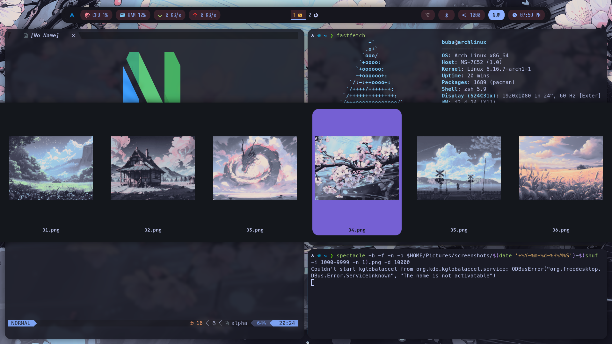

# Arch i3 Dotfiles

This repository contains my Arch i3 Dotfiles. It also contains:

- Instructions for setting up these dotfiles on a freshly
  installed system
- Wallpapers I use
- My custom LaTeX template

System Configuration:

- Distro : `Arch Linux`
- WM : `i3`
- Terminal : `Alacritty`
- Terminal Font : `Meslo LGS NF`
- Bar : `Polybar`
- Editor : `Neovim`
- Shell : `Zsh`
- Launcher : `Rofi`
- Browser : `Firefox`
- Screenshot Tool : `Spectacle`
- File Explorer : `Thunar`

Thanks a lot to `@rosemarys_baby` for helping me out whenever
I was clueless during my first Arch installation.

After being almost a complete year into using Arch as my
primary OS, I get why the veterans are so fixated on making
the newbies read the
[Arch Wiki installation guide][archinstallguide].
Read the Wiki people. :joy:

A few resources for installing Arch Linux:

- [Arch (Wiki) installation guide][archinstallguide]
- [Arch installation guide by Mental Outlaw][mentaloutarchinstall]
- [Setting up Graphical Environments and
  Users by Luke Smith][archlinuxlukesmith]

## :rocket: Overview of my Arch i3 rice

> [!NOTE]
> Follow [this](RICING.md) guided manual for ricing the setup.

Here are the screenshots of my current rice. My previous
rices can be found in
[dotfiles-screenshots/](dotfiles-screenshots)
directory. The wallpapers which I use
can be found in [wallpapers/](wallpapers) directory.

|                     :night_with_stars: TokyoNight                     |
| :-------------------------------------------------------------------: |
|  |

|                         :milky_way: CoolNight                         |
| :-------------------------------------------------------------------: |
|  |

### :butterfly: Changing themes and wallpapers on the fly

I've finally added the functionality of changing
color schemes and wallpapers on the fly
using a rofi applet. (This applet is due to
[gh0stzk](https://github.com/gh0stzk).)

|               :art: Color Scheme Selector                |
| :------------------------------------------------------: |
|  |

|           :sunrise_over_mountains: Wallpaper Selector            |
| :--------------------------------------------------------------: |
|  |

---

## :books: Additional resources

- [Archived packages for Arch][archarchive]

## :memo: TODOs

- [ ] Create a script for switching between rices
      for laptop specific features.

[archinstallguide]: https://wiki.archlinux.org/title/Installation_guide
[mentaloutarchinstall]: https://youtu.be/rUEnS1zj1DM?si=ftzJVo7DClwe8sOJ
[archarchive]: https://archive.archlinux.org/packages/
[archlinuxlukesmith]: https://youtu.be/nSHOb8YU9Gw?si=o0N_tjCUDyeJyQTW
